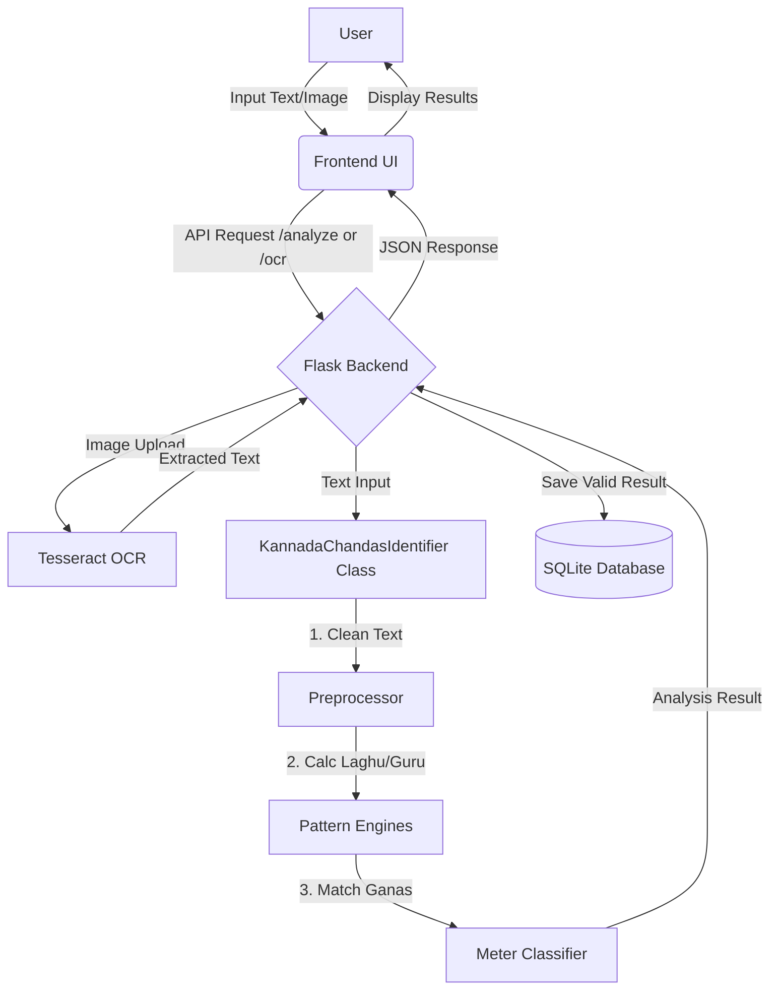

# **Kannada Chandas Identifier (ಕನ್ನಡ ಛಂದಸ್ಸು)**


> An AI-powered tool to analyze and identify the meter (Chandas) of Kannada poems.

<div align="center">
  
  <br/><br/>
  
</div>

<br/>

<div align="center">
  <a href="https://kannada-chandas-identifier-phase-1-1.onrender.com/">
    
  </a>
</div>

---

## **🚀 Features**

Unlock the beauty of Kannada literature with these powerful features:

*   **🔍 Precision Meter Identification**: Detects complex Laghu/Guru patterns and Matra counts to identify meters like **Kanda Padya**, **Shatpadi** (Bhamini/Vardhaka), and various **Vruttas** (Utpalamala, Champakamala, etc.).
*   **📷 OCR Capability**: Upload images of poems! The integrated Tesseract OCR automatically extracts text for analysis.
*   **📝 Multi-Stanza Support**: Paste entire poems; the tool intelligently separates and analyzes each stanza individually.
*   **💾 Auto-Save History**: Your analyzes are precious. Valid results are automatically saved to a local SQLite database (`chandas.db`) for easy retrieval.
*   **📄 PDF Reports**: Generate and download professional PDF reports of your analysis.
*   **📊 Visual Scansion**: See the poem's skeleton with a clear line-by-line breakdown of Laghu (U) and Guru (-) markers.

---

## **🏗️ Tech Stack**

This project is built using a robust and modern technology stack:

| Component | Technology | Description |
| :--- | :--- | :--- |
| **Backend** |   | Core logic and API handling. |
| **Frontend** |   | Responsive and beautiful user interface. |
| **OCR Engine** |  | Optical Character Recognition for image inputs. |
| **Database** |  | Lightweight local storage for analysis history. |
| **Image Processing** |  | Image manipulation for OCR preprocessing. |

---

## **🏛️ Architecture**

### **System Flow**

The application follows a clean client-server architecture.



### **Core Algorithm (`KannadaChandasIdentifier`)**

The heart of the application lies in the `KannadaChandasIdentifier` class in `app.py`. Here's how it works:

1.  **Text Cleaning**: Removes non-Kannada characters (except spaces) to ensure noise-free analysis.
2.  **Laghu/Guru Assignment**: 
    *   Iterates through characters.
    *   Assigns **Guru (-)** for long vowels, specific consonant clusters (Vattakshara), and Yogavahas (Anusvara/Visarga).
    *   Assigns **Laghu (U)** for short vowels.
3.  **Gana Grouping**: Groups the Laghu/Guru sequence into triplets (Ganas) like 'Ma', 'Ya', 'Ra', etc.
4.  **Pattern Matching**:
    *   **Vruttas**: Checks for specific Gana sequences (e.g., *Utpalamala* matches `Bha-Ra-Na-Bha-Bha-Ra-La-Ga`).
    *   **Matra Meters**: Calculates total Matras (time units) per line to identify **Kanda Padya** or **Shatpadi**.

---

## **📂 Project Structure**

```
Kannada_Chandas_Identifier_phase_1/
├── app.py                # 🧠 Main Flask application & Logic
├── index.html            # 🎨 Frontend UI (HTML/JS/Tailwind)
├── requirements.txt      # 📦 Python Dependencies
├── dockerfile            # 🐳 Docker configuration
├── chandas.db            # 🗄️ SQLite Database (Auto-generated)
├── favicon.png           # 🖼️ Icon assets
└── README.md             # 📖 Documentation
```

---

## **🛠️ Installation**

### **Prerequisites**
1.  **Python 3.x** installed.
2.  **Tesseract OCR** installed (Critical for image features).

### **Step 1: Install Tesseract OCR**
This is required for the image scanning feature.

*   **Windows**: 
    *   Download from [UB-Mannheim/tesseract](https://github.com/UB-Mannheim/tesseract/wiki).
    *   **Crucial**: Select **"Kannada"** scripts during installation.
    *   Reference path: `D:\tessaract\tesseract.exe` (Update in `app.py` if different).
*   **Linux**: `sudo apt install tesseract-ocr tesseract-ocr-kan`
*   **Mac**: `brew install tesseract-lang`

### **Step 2: Setup Project**
```bash
# 1. Clone the repository
git clone https://github.com/yourusername/Kannada_Chandas_Identifier.git
cd Kannada_Chandas_Identifier

# 2. Install dependencies
pip install -r requirements.txt
```

### **Step 3: Run the App**
```bash
python app.py
```
> You should see: `SUCCESS! Server is running on http://127.0.0.1:5000`

---

## **📖 Usage Guide**

1.  **Analyze Text**: Type/Paste your poem in the main text box. Click **Analyze**.
2.  **Scan Image**: Toggle to the Image tab (if available) or use the "Scan Image" button. Upload a `.png` or `.jpg`.
3.  **View Results**: The result cards will show the meter, ganas, and line-by-line breakdown.
4.  **History**: Click the **History** icon to revisit past analysis.

---

## **❓ Troubleshooting**

| Issue | Solution |
| :--- | :--- |
| **Tesseract Not Found** | Ensure Tesseract is installed and the path in `app.py` matches your system path. |
| **OCR Errors** | Make sure you installed the **Kannada** language pack for Tesseract. |
| **Server Error** | check your terminal for Python tracebacks. Ensure all dependencies are installed. |

---

<div align="center">
  <i>Made with ❤️ for Kannada Literature</i>
</div>
